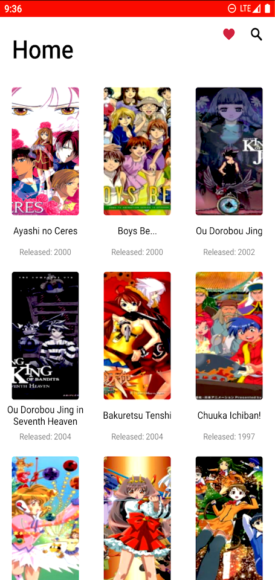
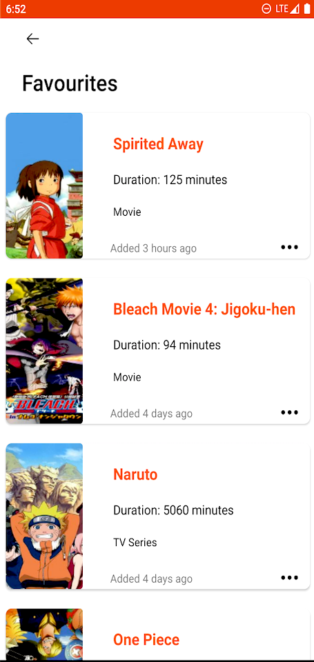
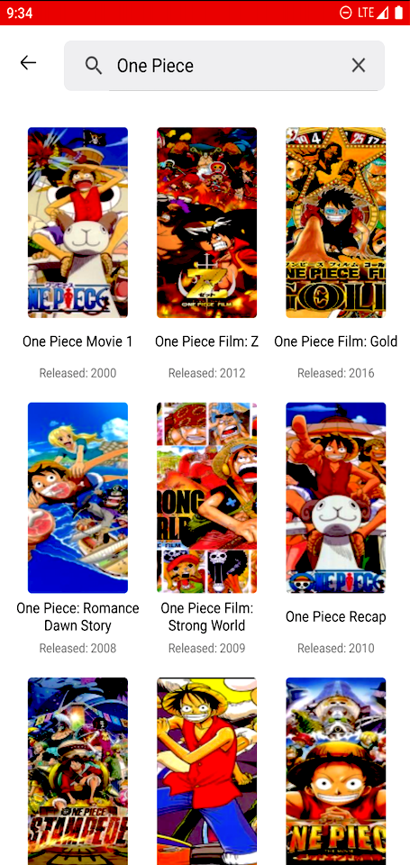
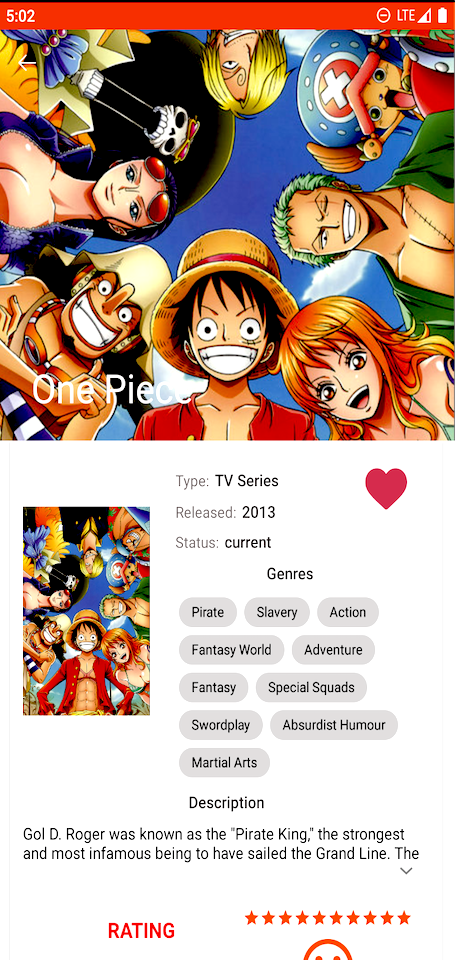
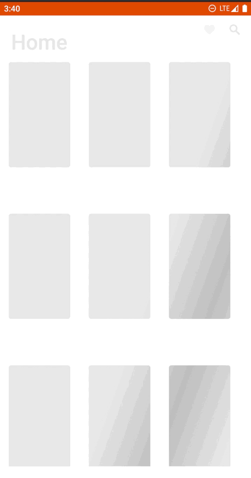

# A program written entirely in Kotlin using the principles of Clean Architecture according to the MVVM pattern.

An application that shows a list of anime and detailed information about them, the ability to
search, as well as add to favorites. The selected data is stored in a remote database on the
server [Back4App](https://www.back4app.com)

## Libraries

### Android Jetpack

* [ViewBinding](https://developer.android.com/topic/libraries/view-binding) View binding is a
  feature that makes it easier for you to write code that interacts with views.

* [Lifecycle](https://developer.android.com/topic/libraries/architecture/lifecycle) An interface
  that automatically responds to lifecycle events.

* [Paging 2](https://developer.android.com/topic/libraries/architecture/paging) Swap Library helps
  to load and display small pieces of data at the same time. Downloading partial data on demand
  reduces the use of network bandwidth and system resources.

* [Navigation](https://developer.android.com/guide/navigation?gclsrc=aw.ds&gclid=Cj0KCQiA09eQBhCxARIsAAYRiymyM6hTEs0cGr5ZCXOWtLhVUwDK1O86vf8V_Uq2DWvVYNFZwPFznzAaAllMEALw_wcB)
  Navigation refers to interactions that allow users to navigate through , enter, and exit various
  parts of the content in your app. Navigation component Android Jetpack helps you navigate, from
  simple button clicks to more complex templates like application panels and navigation bar. The
  navigation component also provides a consistent and predictable user interface, adhering to an
  established set of principles.

* [LiveData](https://developer.android.com/topic/libraries/architecture/livedata) Data objects that
  notify views of changes to the underlying database.

* [Kotlin flows](https://developer.android.com/kotlin/flow) In coroutines, a flow is a type that can
  emit multiple values sequentially, as opposed to suspend functions that return only a single
  value. For example, you can use a flow to receive live updates from a database.

* [ViewModel](https://developer.android.com/topic/libraries/architecture/viewmodel) Data related to
  the user interface that is not destroyed when the application is rotated. Easily schedule
  asynchronous tasks for optimal execution.

### DI

* [Hilt](https://developer.android.com/training/dependency-injection/hilt-android) Hilt is a
  dependency injection library for Android that reduces the execution time of manual dependency
  injection into your project. Performing manual dependency injection requires that you create each
  class and its dependencies manually, and use containers to reuse and manage dependencies.

### Image

* [Picasso](https://square.github.io/picasso/) Picasso allows you to easily upload images to your
  app - often in a single line of code.

### HTTP

* [Retrofit2](https://github.com/square/retrofit) Type-safe HTTP client for Android and Java.

* [OkHttp](https://github.com/square/okhttp) HTTP + HTTP/2 client for Android and Java applications.

### Coroutines

* [Kotlin Coroutines](https://github.com/Kotlin/kotlinx.coroutines) Coroutines is a rich library for
  coroutines developed by JetBrains. It contains a number of high-level primitives with support for
  coroutines, which are discussed in this guide, including startup, asynchrony, and others.

### GitHub Custom Libraries

* [Simple Rating View](https://github.com/xiprox/SimpleRatingView) A rating toggle for Android which
  switches between 3 rating levels: positive, neutral, and negative.

* [Expandable TextView](https://github.com/Manabu-GT/ExpandableTextView) ExpandableTextView is an
  Android library that allows developers to easily create an TextView which can expand/collapse just
  like the Google Play's app description. Feel free to use it all you want in your Android apps
  provided that you cite this project.

* [Flow Layout](https://github.com/ApmeM/android-flowlayout) Extended linear layout that wrap its
  content when there is no place in the current line.

* [Pretty Time](https://github.com/ocpsoft/prettytime) Social Style Date and Time Formatting for
  Java

* [Shimmer](https://github.com/facebook/shimmer-android) Shimmer is an Android library that provides
  an easy way to add a shimmer effect to any view in your Android app.

